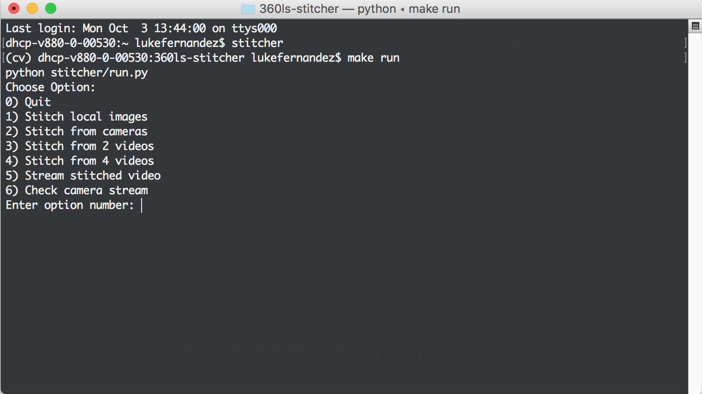

This portion of the website highlights the functional specification for the first development sprint. This functional specification includes use cases, requirements, and interfaces targeted and achieved during that sprint. 

# Use Cases

## Use Cases Targeted

### On-box Application
- Display a Stitched Video (use case of program to enable watching live video)
	- Take video input from four camera streams and stitch it into one video
	- Convert that stitched video into multiple encodings of a 360 degree video 
	- Send 360 degree video to server to interact with streaming service
- Stream Video (use case of program to enable streamed video in on-box and web applications)
	- Send stitched video to a server for storage
	- Live stream stitched video from server storage and live device stitched footage

## Use Cases Realized

### On-box Application
- Display a Stitched Video (use case of program to enable watching live video)
	- Take video input from two camera streams and stitch it into one video
	- Take video and image input from four local sources and stitch together
- Stream Video (use case of program to enable streamed video in on-box and web applications)
	- Output stitched video to a socket for RTMP data stream consumption
 

## Summary of Use Case Fulfillment
During Sprint 1, we sought to develop a functioning stitching script that would read in input from 4 cameras, stitch those inputs into one 360 degree video, and save multiple encoded video files to local disk. We did not intend 100% accuracy of stitching or necesarily robust implementation, but we wanted an MVP to make sure that the stitching aspect of our project, the most crucial part, was in fact possible and implementable in the time that we have alotted for the semester. As a result of the sprint, we were able to complete the majority of our Display a Stitched Video use case, but we still have a good way to go with the Stream Video use case.

# Requirements
 
## Requirements Targeted
At the beginning of Sprint 1, we prioritized our requirements for the sprint as follows (with prioritization representing order of approach, not necessarily in order of project value):

### Priority 1
- The Box
	- Stitch 4 videos together (9/18 - 9/28)
		- Completed stitching script for local and camera inputs.
		- Set up hardware to process 4 video streams for consumption in the stitching script

### Priority 2
- The Box
	- Encode video into different forms (9/24 - 9/29)
	- Save video to local device (9/27 - 10/1)

### Priority 3
- Server-side Implementation
	- Determine and instantiate model and view design (9/25 - 10/1)
	- System and Database Design (9/26 - 10/1)

## Requirements Realized
After completion of Sprint 1, we were able to complete the following requirements. Though we did not complete all of the requirements that we initially set out to complete, we did, as a result of our struggles, gain perspective on what we might be able to accomplish by the end of the semester.

### Priority 1
- The Box
	- Stitch 4 videos together (9/18 - 9/28)
		- Completed stitching script for local (4 videos or 4 images) and camera (2 cameras) inputs.
	- Developed command line interface to interact with the stitching mechanism. 
	- Implemented continuous integration deployment via Travis CI

### Priority 2
- The Box
	- Encode video into different forms via ffmpeg
	- Gain understanding of Wowza web service for implementing streaming capabilities.

# Interfaces
Though we did not originally target completion of any of the interfaces affiliated with the completion of our app during this specific sprint, we did in fact develop a CLI for easy navigation through and interaction with our stitching application. An example progression of that cli can be seen below. This CLI would be used by anyone who wanted to test or run the existing stitcher code.

