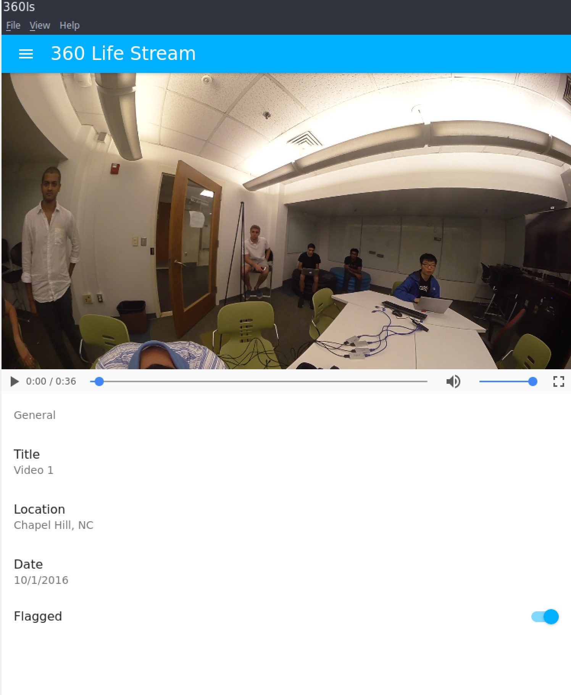

This portion of the website highlights the functional specification for the third development sprint. This functional specification includes use cases, requirements, and interfaces targeted and achieved during that sprint. 

# Use Cases

## Use Cases Targeted

### On-box Application
- Display a Stitched Video (use case of program to enable watching live video)
	- Take video input from four camera streams, correct distortion, and stitch it into one video
	- Convert that stitched video into multiple encodings of a 360 degree video 
	- Send 360 degree video to server to interact with wowza streaming service
	- Correct distortion on videos
- Stream Video (use case of program to enable streamed video in on-box and web applications)
	- Send stitched video to a server for storage
	- Live stream stitched video from server storage and live device stitched footage
- Watch Live Video
	- See the situation around the car from a live on-latency feed on the in-car box.
	- See live video in a simple player in the web application

## Use Cases Realized

### On-box Application
- Display a Stitched Video (use case of program to enable watching live video)
	- Take video input from four camera streams, correct_distortion, and stitch it into one stream (Super close.)
	- Take video and image input from four local sources and stitch together
	- Send 360 degree video to server to interact with wowza streaming service
- Stream Video (use case of program to enable streamed video in on-box and web applications)
	- Send stitched video to hosted Wowza platform.
	- Live stream stitched video from Wowza to web player
 

<!-- ## Summary of Use Case Fulfillment
During Sprint 3, we sought to build upon -->

# Requirements
 
## Requirements Targeted
At the beginning of Sprint 3, we prioritized our requirements for the sprint as follows (with prioritization representing order of approach, not necessarily in order of project value):

### Priority 1
- The Box
	- Stitch 4 videos together and stream them to Wowza
		- Completed stitching script for local and camera inputs.
		- Set up hardware to process 4 video streams for consumption in the stitching script
	- Create electron box application for handling incoming Wowza streams.
	- Set up a file system to store videos locally
	- Improve stitching algorithm to work well with 4 live video streams, fix distortion, and use cubemap if necessary

### Priority 2
- The Box
	- Handle flexible stitching of invalid stream inputs.
- Server-side Implementation
	- Get Django application up and running with Wowza streaming to React-enable frontend.

## Requirements Realized
After completion of Sprint 3, we were able to complete the following requirements. We got very close to completing all of the requirements we needed to complete. 

### Priority 1
- The Box
	- Stitch 4 videos together and stream them to Wowza
		- Completed stitching script for local and camera inputs.
		- Set up hardware to process 4 video streams for consumption in the stitching script
	- Create electron box application for handling incoming Wowza streams.
	- Set up a file system to store videos locally
	- Improve stitching algorithm to work well with 4 live video streams, fix distortion, and use cubemap if necessary (Got much closer)

# Interfaces
After improving the project website and upgrading the stitching cli, we also added significant functionality to the desktop application. Here are a few example views.

