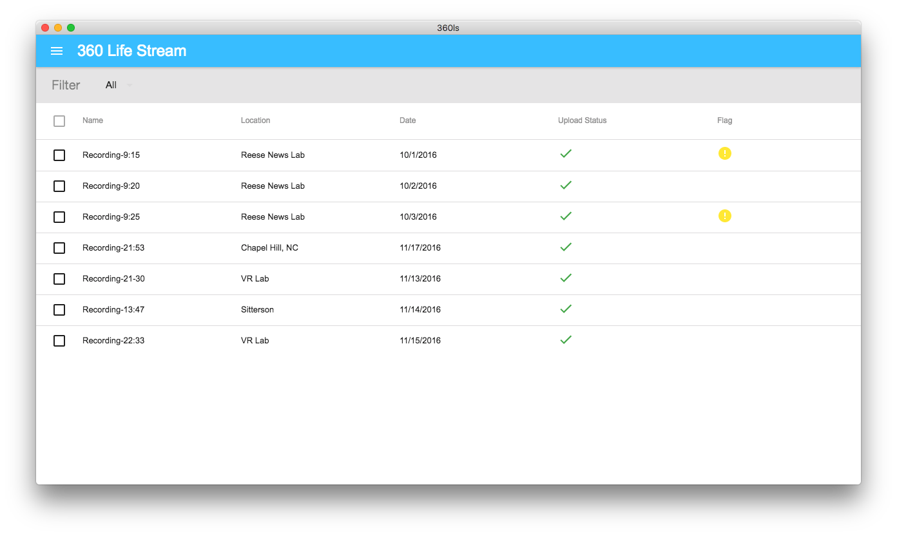
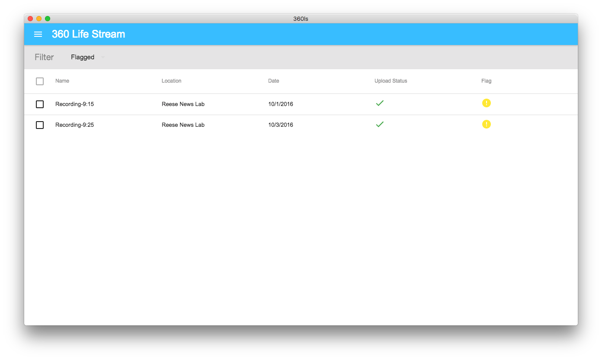
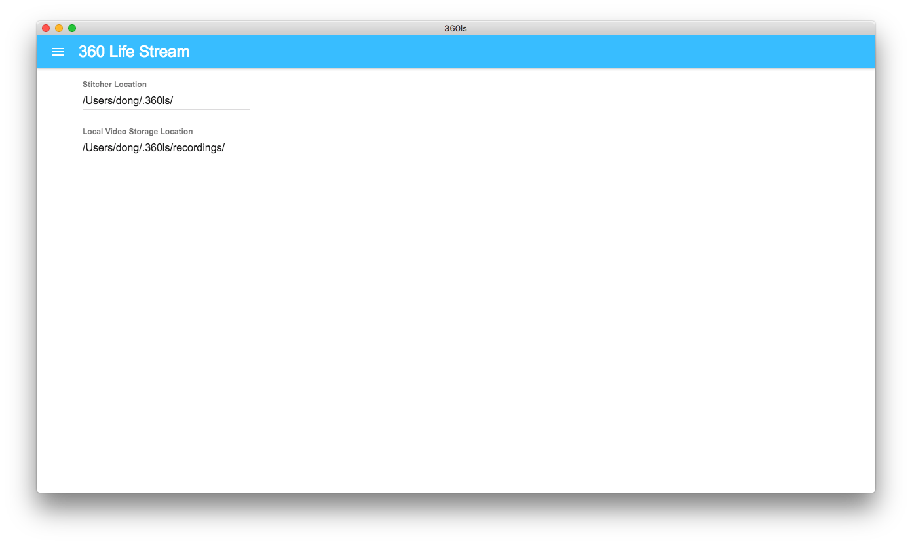
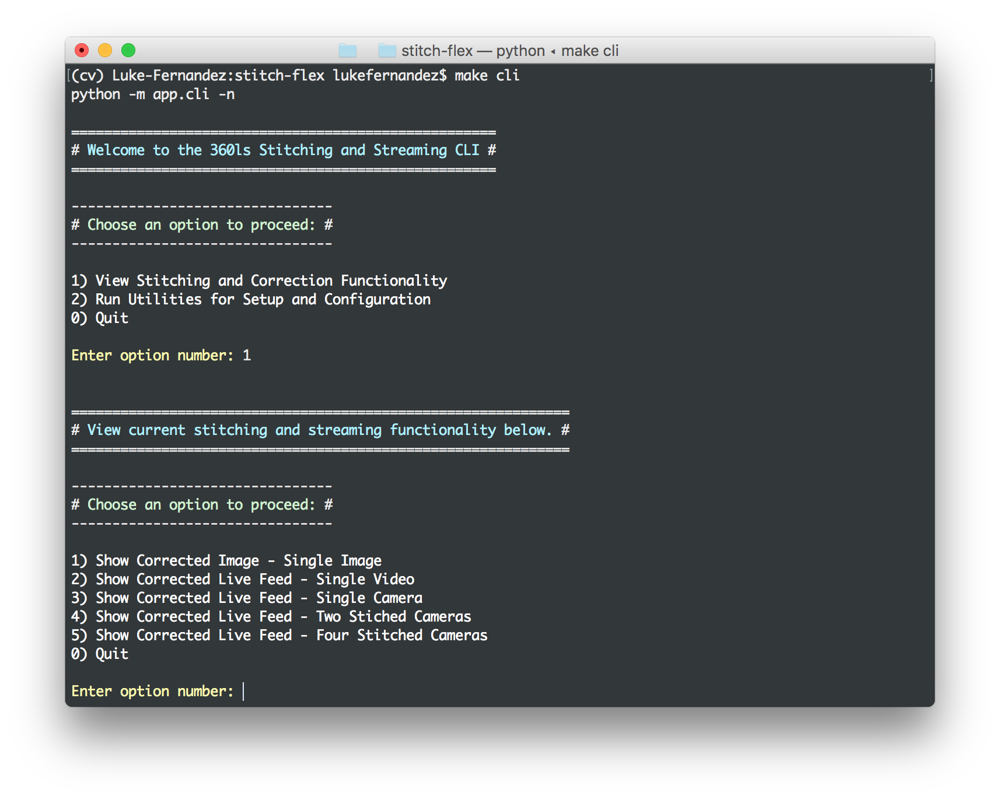

This portion of the website highlights the functional specification for the fourth development sprint. This functional specification includes use cases, requirements, and interfaces targeted and achieved during that sprint.

# Use Cases

## Use Cases Targeted

### Web Application
- Watch Live Video
    - See live stream in browser via web player
    - Change video display quality

- Watch Archived Video
	- Watch saved videos in browser via web player
    - Pause the video
    - Rewind the video
    - Full screen the video
    - Change video display quality

### On-box Application
- Display a Stitched Video (use case of program to enable watching live video)
	- Take video input from two camera feeds, correct distortion, and stitch it into one video
	- Correct distortion on videos
	- Recognize when a feed is dead or occluded for adaptive stitching

- Stream Video (use case of program to enable streamed video in on-box and web applications)
	- Send stitched video to a server for storage
	- Send stitched video to RTMP stream for consumption

- Stitch and Stream Video from Desktop Application
	- Combine stitching and streaming of video and allow for calling within the Desktop application

- Watch Live Video
	- See the situation around the car from a live on-latency feed on the in-car box.
	- See live video in a simple player
- Watch Archived Videos
	- Pause the video
	- Rewind the video
	- Full screen the video

- Filter Archived Videos
	- Scroll through a list of all videos associated with the user's account.
	- Filter to find video by date, etc.

- Flag Videos for Consideration
	- Allow the user to flag a video for later consideration and tracking

- Manually Start and Stop Recording
	- Allow the user to toggle between a recording and non-recording state.

### Server-side
- Stream Video to Client (use case of program to stream via Wowza from storage and live stitched stream)
	- Consume RTMP stream from box application
	- Live stream stitched video from server storage and live device stitched footage to client players.

## Use Cases Realized

### Web Application
- Watch Live Video
    - See live stream in browser via web player
    - Change video display quality

### On-box Application
- Display a Stitched Video (use case of program to enable watching live video)
	- Take video input from two camera feeds, correct distortion, and stitch it into one video
	- Correct distortion on videos
	- Recognize when a feed is dead or occluded for adaptive stitching

- Stream Video (use case of program to enable streamed video in on-box and web applications)
	- Send stitched video to a server for storage
	- Send stitched video to RTMP stream for consumption

- Stitch and Stream Video from Desktop Application
	- Combine stitching and streaming of video and allow for calling within the Desktop application

- Watch Archived Videos
	- Pause the video
	- Rewind the video
	- Full screen the video

- Filter Archived Videos
	- Scroll through a list of all videos associated with the user's account.
	- Filter to find video by date, etc.

- Flag Videos for Consideration
	- Allow the user to flag a video for later consideration and tracking

- Manually Start and Stop Recording
	- Allow the user to toggle between a recording and non-recording state.

### Server-side
- Stream Video to Client (use case of program to stream via Wowza from storage and live stitched stream)
	- Consume RTMP stream from box application
	- Live stream stitched video from server storage and live device stitched footage to client players.

## Summary of Use Case Fulfillment
During Sprint 4, we sought to have end to end functionality as follows, implemented on our box hardware:

1. Receive two camera feeds

2. Correct and stitch camera feeds

3. Send stitched frames via RTMP to Wowza

4. Stream to desktop and web applications from Wowza

We came very close to demonstrating this functionality, but we ran into issues configuring the box. After spending hours and hours configuring the box, we were able to demonstrate full functionality pieced together, even though it was not as perfect as we would have liked. That said, when we went in to demo for our client, we ran into trouble with our build and were not able to show the full end to end functionality that we had hoped to show in-person. That said, we are very close to having all of the basic functionality that we need for our project, at least with a two-camera array, and we fulfilled almost all of the use cases that we laid out for the development sprint.

# Requirements

## Requirements Targeted
At the beginning of Sprint 4, we prioritized our requirements for the sprint as follows (with prioritization representing order of approach, not necessarily in order of project value):

### Priority 1
- The Box
	- Stitch 2 videos together and stream them to Wowza
		- Completed stitching script for local video and camera feed inputs
		- Set up hardware to process 2 feeds for consumption in the stitching script
		- Handle correction from within stitching algorithm
	- Create Electron box application for handling display of streams and local videos.
		- Call python script to correct, stitch, and stream feeds from within Electron
	- Set up a file system to store videos locally on the box
	- Improve stitching algorithm to work well with live video streams, fix distortion, and use cubemap if necessary

### Priority 2
- The Box
	- Handle flexible identification of invalid feed inputs.

- Web Application
	- Get Django application up and running with Wowza streaming to React-enable frontend.
	- Set up RESTful endpoint for video upload into online storage

- Server-side
	- Get reliable Wowza streaming hosted in a PaaS offering (Heroku or AWS, preferably.)
	- Set up storage for archival of videos

## Requirements Realized
After completion of Sprint 4, we were able to complete the following requirements, all that we set out to complete in one for or another.

### Priority 1
- The Box
	- Stitch 2 videos together and stream them to Wowza
		- Completed stitching script for local video and camera feed inputs
		- Set up hardware to process 2 feeds for consumption in the stitching script
		- Handle correction from within stitching algorithm
	- Create Electron box application for handling display of streams and local videos.
		- Call python script to correct, stitch, and stream feeds from within Electron
	- Set up a file system to store videos locally on the box
	- Improve stitching algorithm to work well with live video streams, fix distortion, and use cubemap if necessary
		- Vastly improved performance of stitching algorithm, moving from SIFT to SURF, brute-force to FLANN, and looking to move from SURF to FAST in the near future.

### Priority 2
- The Box
	- Handle flexible identification of invalid feed inputs.

- Web Application
	- Get Django application up and running with Wowza streaming to React-enable frontend.
	- Set up RESTful endpoint for video upload into online storage

- Server-side
	- Get reliable Wowza streaming hosted in a PaaS offering (Heroku or AWS, preferably.)
	- Set up storage for archival of videos

## Correspondence to Original Requirements
** These requirements map to the following items from our requirements list from the beginning of the project: **

### Priority Level 1

1. There will be a display of a table of all accessible archived videos. This table will be able to be filtered by date and by officer.

2. The app should be able to query the database and get encoded video files

3. Officers should be able to click on archived videos and see the video displayed in the player.

# Interfaces
The following interface views show the current state of the desktop application:

Also, the CLI for testing the stitching and streaming functionality of the application has been vastly improved. Here is an example of that improvement:

As far as interfaces go, we also cleaned up our website navigation menu. Working with it in the past was messy when trying to navigate to different aspects of different sprints, so we cleaned up the CSS to make sure that menus did not overlap and confuse the user. This is what it looks like now:

