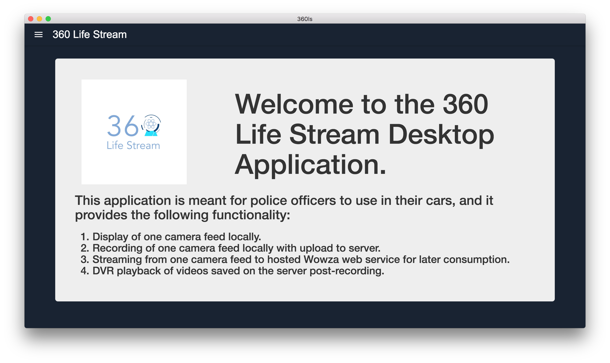
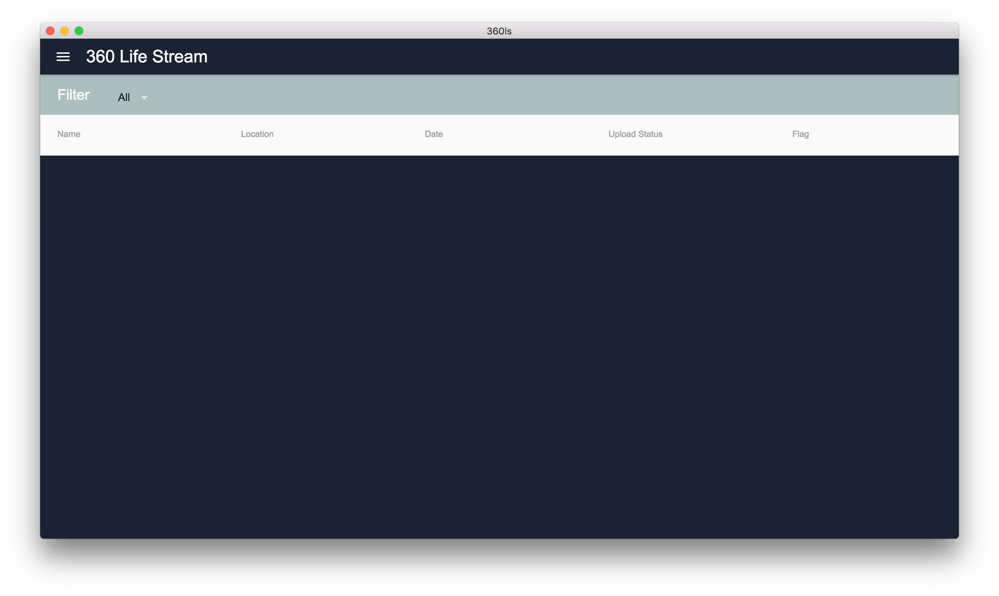
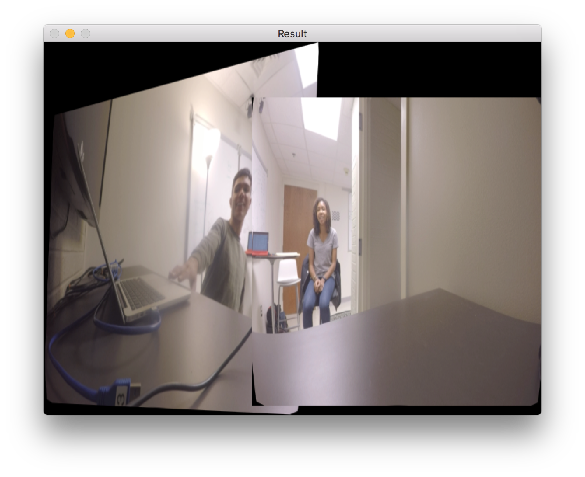

This portion of the website highlights the functional specification for the fifth development sprint. This functional specification includes use cases, requirements, and interfaces targeted and achieved during that sprint. Because this was the last sprint, it also provides final versions of our interfaces, along with an evaluation of where we ended up at the end of the semester.

# Use Cases

## Use Cases Targeted

### Web Application

- Watch Live Video
	- Pan around the 360 video

- Filter Archived Videos
	- The user can scroll through a list of all videos
	- Filter to find by date, or officer ID

- Watch Archived Video
	- Pan around the 360 video
	- Pause the video
	- Rewind the video

### On-box Application

- Watch Live Video In-app
	- See the situation around the car from a live no-latency feed on the in-car box.
	- Integrated in box application.

- Filter Archived Videos
	- The user can scroll through a list of all videos associated with their account
	- Filter to find by date, etc.

- Watch Archived Video
	- Pause the video
	- Rewind the video

- Manually Start and Stop Recording
	-The user can toggle between a recording and docile state

- Display a Stitched Video (use case of program to enable watching live video)
	- Take video input from four camera streams and stitch it into one video
	- Convert that stitched video into multiple encodings of a 360 degree video

- Stream Video (use case of program to enable streamed video in on-box and web applications)
	- Send stitched video to a server for storage
	- Live stream stitched video from server storage and live device stitched footage

## Use Cases Realized

### Web Application

- Watch Live Video
	- Pan around the 360 video

- Filter Archived Videos
	- The user can scroll through a list of all videos
	- Filter to find by date, or officer ID

- Watch Archived Video
	- Pan around the 360 video
	- Pause the video
	- Rewind the video

### On-box Application

- Watch Live Video
	- See the situation around the car from a live no-latency feed on the in-car box.
	- Outside of box application.

- Filter Archived Videos
	- The user can scroll through a list of all videos associated with their account
	- Filter to find by date, etc.

- Watch Archived Video
	- Pause the video
	- Rewind the video

- Manually Start and Stop Recording
	-The user can toggle between a recording and docile state

- Display a Video (use case of program to enable watching live video)
	- Take video input from one camera feed and display that video

- Stream Video (use case of program to enable streamed video in on-box and web applications)
	- Send stitched video to a server for storage
	- Live stream stitched video from server storage and live device stitched footage

## Summary of Use Case Fulfillment
During Sprint 5, we came very close to demonstrating all of the functionality that we wanted to demonstrate. The only two things that we missed out on were integrated stitching, which was not possible with hardware constraints, and live preview within the app. To compensate for lack of live preview in the app, we provided live preview in a separate window outside of the app, but automatically maximized that window to make the interaction with the live view seamless.

# Requirements

## Requirements Targeted
At the beginning of Sprint 5, we prioritized our requirements for the sprint as follows (with prioritization representing order of approach, not necessarily in order of project value):

### Priority 1

1. There will be a display of a table of all accessible archived videos. This table will be able to be filtered by date and by officer.

2. The app should be able to query the database and get encoded video files

3. Officers should be able to click on archived videos and see the video displayed in the player. They can pan around the video, pause the recording, and rewind.

4. DVR capability should be available in desktop and web apps

### Priority 2

1. There will be a list of all live videos that will be identified by officer

2. The app will pipe in live videos from the devices on the cars.

## Requirements Realized
After completion of Sprint 5, we were able to complete the following requirements, all that we set out to complete in one form or another.

### Priority 1

1. There will be a display of a table of all accessible archived videos. This table will be able to be filtered.

2. The app should be able to query the database and get encoded video files

3. Officers should be able to click on archived videos and see the video displayed in the player. They can pan around the video, pause the recording, and rewind.

4. DVR capability should be available in desktop and web apps

### Priority 2

1. There will be a list of all live videos that will be identified by officer

2. The app will pipe in live videos from the devices on the cars.

# Interfaces
The following interface views show the final state of the desktop application:

The following interface view shows the final state of the web application:

The following images show examples of the stitch that we were able to achieve at the end of the semester:

# Final Evaluation
Though we did not end up with exactly what we had hoped to end up with at the end of the semester, we came much farther than I ever could have imagined. Possibly the hardest part of the project, stitching, became a problem as we got closer and closer to the end of the project, but we were able to find a way to make it work, at least in the form of a proof of concept. Using a plethora of new hardware and software that none of the people in our group had ever used, we were able to make a lot of things happen, and it came through a lot of hard work. I am proud of where we ended up as a team, and I think our work reflects the many many hours that we put in to bring this thing to fruition.
